# MMM-NestRemoteThermostat

This is a module for the [MagicMirror²](https://github.com/MagicMirrorOrg/MagicMirror/) to display a [Nest](https://store.google.com/ca/product/nest_learning_thermostat_3rd_gen) Like thermostat from a remote sensor that is capable to POST the measured values through HTTP protocol. It is designed to be generic. Useful when having Home Assistant and MagicMirror².

For updates, please check the [CHANGELOG](https://github.com/sisimomo/MMM-NestRemoteThermostat/blob/master/CHANGELOG.md).

## Features

When the page load, the first state will be loading until the module receive data :
```js
{
    state: "off",	// Can be any thing between : ['off', 'heating', 'cooling', 'fan', 'dry' ]
    loading: true
}
```

<p>
  
  
  
  
  
</p>

---

Here is the state of the module when Heating with and without fan speed :
```js
{
    thermostatId: '1',
    targetTemperature: 20,
    ambientTemperature: 21.5,
    state: "heating",
    icon: "fan",
    power: 3 // 0 to hide fan icon
}
```
<p>
  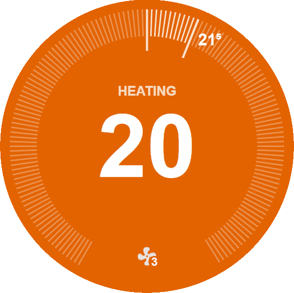
  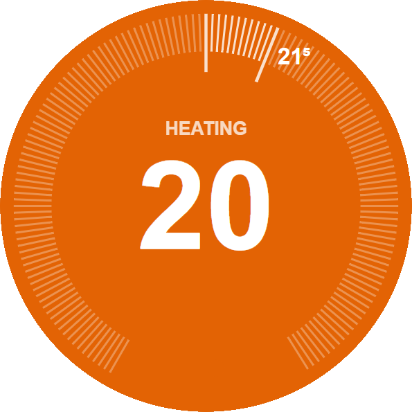
</p>

---

Here is the state of the module when Cooling with and without fan speed :
```js
{
    thermostatId: '1',
    targetTemperature: 19,
    ambientTemperature: 23.5,
    state: "cooling",
    icon: "fan",
    power: 5 // 0 to hide fan icon
}
```
<p>
  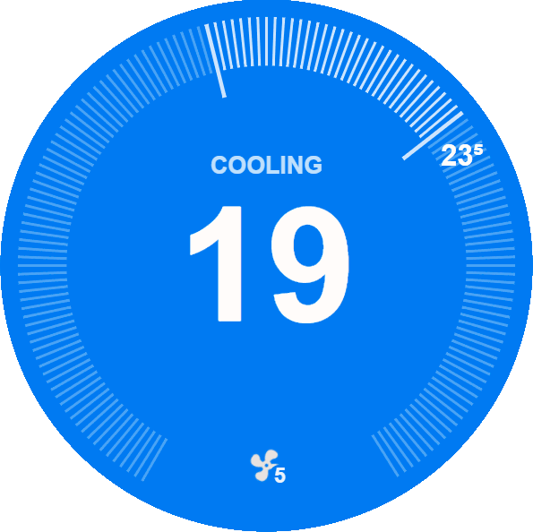
  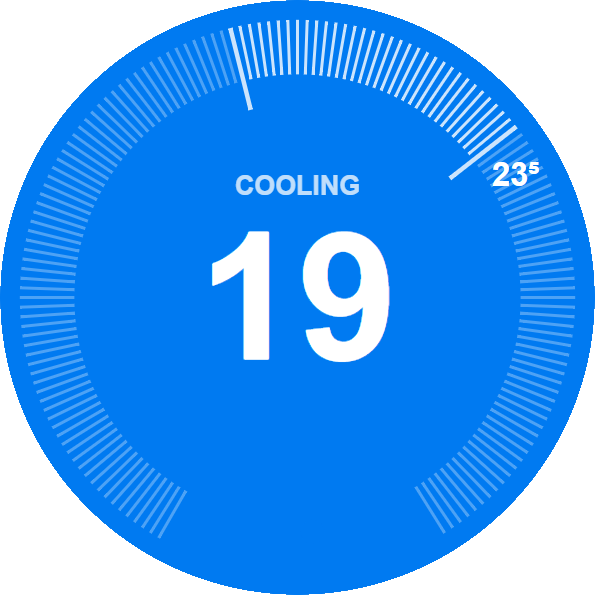
</p>

---

Here is the state of the module when in Fan with and without fan speed :
```js
{
    thermostatId: '1',
    targetTemperature: 21.5,
    ambientTemperature: 21.5,
    state: "fan",
    icon: "fan",
    power: 1 // 0 to hide fan icon
}
```
<p>
  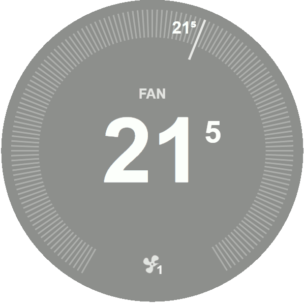
  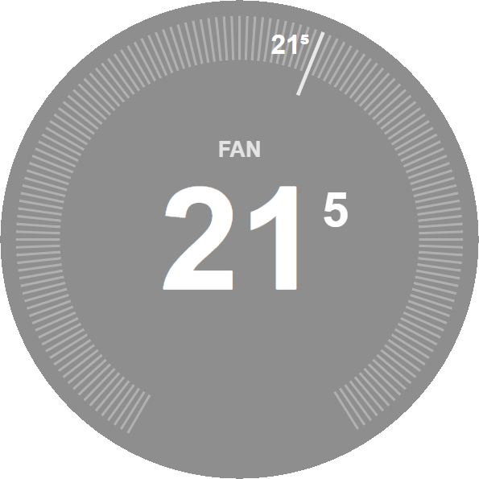
</p>

---

Here is the state of the module when in Dry with and without fan speed :
```js
{
    thermostatId: '1',
    targetTemperature: 19.5,
    ambientTemperature: 19.5,
    state: "dry",
    icon: "fan",
    power: 4 // 0 to hide fan icon
}
```
<p>
  
  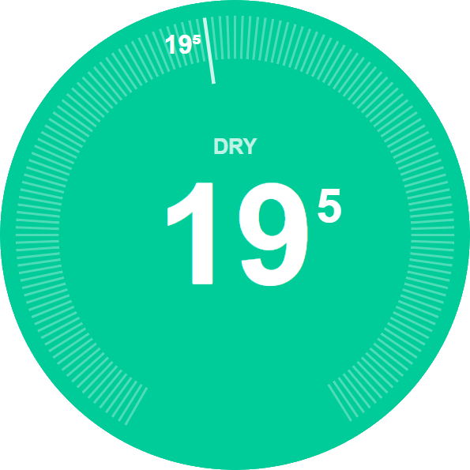
</p>
<br>

## Test it your self

If you want to see how the thermostat look like in any state or play with the configuration easily,  simply [download this repository localy](https://github.com/sisimomo/MMM-NestRemoteTemperature/archive/refs/heads/master.zip) extract it and open [example/example.html](https://github.com/sisimomo/MMM-NestRemoteThermostat/blob/master/example/example.html)

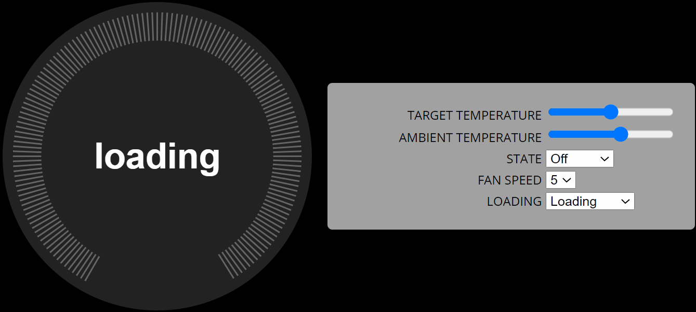


## Using the module

To use this module follow these steps:

1. Switch to the `modules` folder of your MagicMirror

```bash
cd ~/MagicMirror/modules/
```

2. Clone this repository to the `modules` folder

```bash
git clone https://github.com/sisimomo/MMM-NestRemoteThermostat.git
```

3. Switch to the `MMM-NestRemoteThermostat` folder

```bash
cd ./MMM-NestRemoteThermostat/
```

4. Install the 3rd party dependencies

```bash
npm install
```

5. Add the following configuration block to the modules array in the `config/config.js` file:

```js
var config = {
  modules: [
    {
      module: 'MMM-NestRemoteThermostat',
      position: 'top_right',
      config: {
        thermostatId: '1'
      }
    }
  ]
}
```
<br>

### To put in fahrenheit

```js
var config = {
  modules: [
    {
      module: 'MMM-NestRemoteThermostat',
      position: 'top_right',
      config: {
        thermostatId: '1',
        minValue: 50, // Minimum value for target temperature
        maxValue: 86 // Maximum value for target temperature
      }
    }
  ]
}
```
<br>

**!! IMPORTANT !!**

For security reasons the MagicMirror is *not* reachable externally, which also means that it does not accept data from external sources. Make sure you configure the `ipWhitelist` setting in the `config.js` file (see [these lines in the sample config](https://github.com/MichMich/MagicMirror/blob/master/config/config.js.sample#L18-L22)) correctly, so the remote thermostat can communicate with your mirror.

## Configuration options

| Option						| Description
|-------------------------------|-----------
| `thermostatId` 				| **REQUIRED** An arbitrary value that determines from which thermostat this module accepts updates. It can also be used as an API key to restrict access to your mirror.<br><br> **Type:** `String` <br>**Default value:** `null` (must be configured)
| `width`						| The css width of the thermostat. <br><br> **Type:** `String` <br>**Default value:** `'20em'`
| `height`						| The css height of the thermostat. <br><br> **Type:** `String` <br>**Default value:** `'20em'`
| `minValue`					| The lowest displayable value on the dial of the thermostat. <br><br>**Type:** `Integer` <br>**Default value:** `10`
| `maxValue`					| The bigest displayable value on the dial of the thermostat.<br><br> **Type:** `Integer` <br>**Default value:** `30`
| `numTicks`					| Number of tick lines to display around the dial. <br><br> **Type:** `Integer` <br>**Default value:** `150`
| `largeBarThickness`			| Increase of size for large tick line in pixel. <br><br> **Type:** `Integer` <br>**Default value:** `2.5`
| `iconSize`					| The size in px of the fan icon. <br><br> **Type:** `Integer` <br>**Default value:** `50`
| `targetTemperaturePrecision`	| Set the level of precision for display of the target temperature.  E.g., `.5` will round to the nearest half degree, and `1` will round to the nearest degree. (You can set any number you want, but only one decimal place will be displayed at most.)<br><br> **Type:** `Float` <br>**Default value:** `.5`
| `ambientTemperaturePrecision`	| Set the level of precision for display of the target temperature.  E.g., `.5` will round to the nearest half degree, and `1` will round to the nearest degree. (You can set any number you want, but only one decimal place will be displayed at most.)<br><br> **Type:** `Float` <br>**Default value:** `.5`
| `roundTargetTemperature`		| **DEPRECATED** You should remove this from your config file if you have one set, otherwise it could override `targetTemperaturePrecision`.
| `roundAmbientTemperature`		| **DEPRECATED** You should remove this from your config file if you have one set, otherwise it could override `ambientTemperaturePrecision`.
| `diameter`					| The diamiter of the dial. Dosen't affect the size of the dial but the size of the elements on the dials. <br><br> **Type:** `Integer` <br>**Default value:** `400`

## How it works

This module creates a new HTTP endpoint on the mirror's webserver, which handles HTTP POST requests sent by the remote thermostats. The HTTP request must contain the unique identifier you assigned to the thermostat. The module displays the measured value only if the configured `thermostatId` matches the value received in the request.

It is up to the thermostat to define how often it updates the measured data, the mirror will display the last received value.

## Thermostat requirements and communication

This module can work with any thermostat that is capable to periodically send HTTP POST requests with the following standard JSON body to the `http://<your mirror's IP>:8080/remote-nest-thermostat` endpoint:

```js
{
    thermostatId: '1',
    targetTemperature: 19.5,
    ambientTemperature: 19.5,
    state: "dry",
    icon: "fan",
    power: 5,
    loading: false
}
```
<br>
If you want, you can update only the some proprieties. To do so, only specified the proprieties you want to change. The only condition is for the propriety loading.
<br>
<br>

| Option				| Description
|-----------------------|-----------
| `thermostatId`			| **REQUIRED** The arbitrary value set in the config file of the desired thermostat. <br><br> **Type:** `String`
| `loading`				| **REQUIRED** The loading status can be set when ever wanted. When set, it will hide every thing displayed on the dial. <br><br> **Type:** `Boolean` <br>**Default value:** `true`
| `targetTemperature`	| The value that is display in the middle of the thermostat. <br>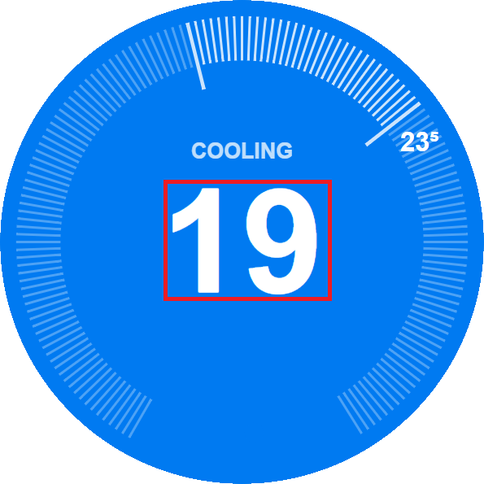 <br><br> **Type:** `Integer`
| `ambientTemperature`	| The value that is display next to the ambient temperature bar of the thermostat. <br>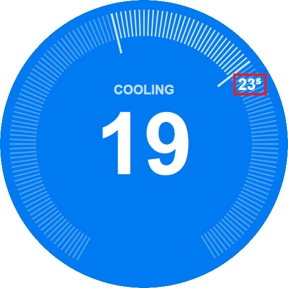 <br><br> **Type:** `Integer`
| `state`			| The state of the thermostat. Can be 'Off', 'Cooling', 'Heating' , 'Fan' or 'Dry'. The background color of the dial also change accordingly. <br><br> **Type:** `String` <br>**Possible values:** `[ 'off', 'heating', 'cooling', 'fan', 'dry' ]`
| `icon`			| The icon of the thermostat. Can be 'Fan', 'Radiator'.<br>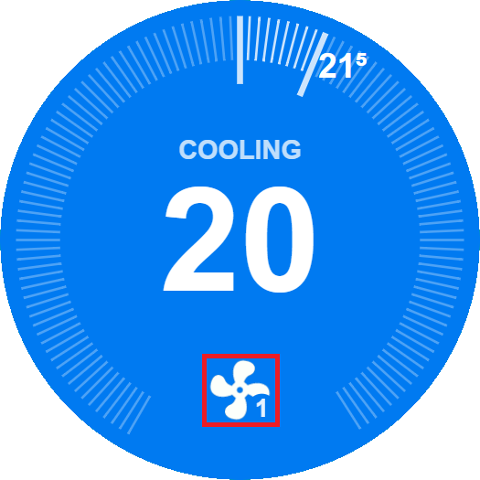 <br><br> **Type:** `String` <br>**Possible values:** `[ 'fan', 'radiator' ]`
| `power`			| The speed of the fan. This value can be set between 0-5. If set to 0, no icon will be show. When first loaded, the value is set to 0.<br><br> **Type:** `Integer` <br>**Possible values:** `[ 0, 1, 2, 3, 4, 5 ]`

Make sure that your thermostat properly sets the `Content-Type` header in the HTTP request to `application/json`, otherwise the module will not be able to parse the request body.

## Localization

Currently this module supports English (`en`) and French (`fr`) languages. The language can be specified in the global `language` setting in the `config.js` file.

Want to see more languages? Please contribute!

## Got feedback ?

Your feedback is more than welcome, please send your suggestions, feature requests or bug reports as [Github issues](https://github.com/sisimomo/MMM-NestRemoteThermostat/issues).

## Acknowledments

Many thanks to [Michael Teeuw](https://github.com/MichMich) for creating and maintaining the [MagicMirror²](https://github.com/MichMich/MagicMirror/) project fully open source.

Base on Magic Mirror Module: [MMM-RemoteTemperature](https://github.com/balassy/MMM-RemoteTemperature) By [György Balássy](https://www.linkedin.com/in/balassy)

Base on codepen.io example [CodePen Home Nest Thermostat Control](https://codepen.io/dalhundal/pen/KpabZB) By [Dal Hundal](https://codepen.io/dalhundal)

## About the author

This project is created and maintained by [Simon Vallières](https://www.linkedin.com/in/simon-vallieres-358555187/).
